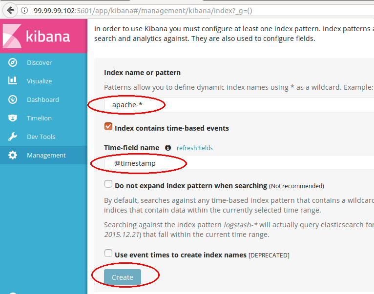
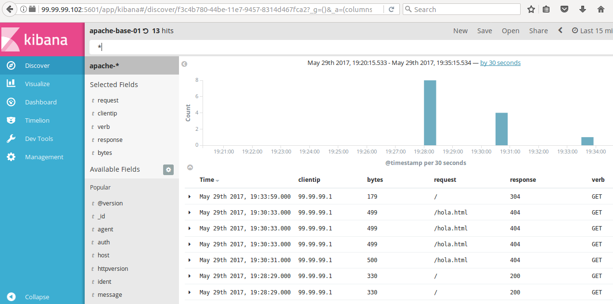

   

# Plataform:
	SO:  	Debian 8.6
	Arch: 	64bits
	RAM: 	1Gb
	HDD: 	8Gb
	All servers are Debian

# Packages
	- Logstash: 		https://artifacts.elastic.co/downloads/logstash/logstash-5.3.2.deb
	- Elasticsearch: 	https://artifacts.elastic.co/downloads/elasticsearch/elasticsearch-5.3.2.deb
	- Kibana package: 	https://artifacts.elastic.co/downloads/kibana/kibana-5.3.2-amd64.deb

# WEBSERVER - 192.168.2.136 

# Update system
	apt-get update

# Install apache2
	apt-get install apache2 -y

# Create a basic index
	echo "<html><h1>Webserver para ELK </h1></html>" >/var/www/html/index.html

# Add repo
	echo "# jessie backports" >>/etc/apt/sources.list
	echo "deb http://http.debian.net/debian jessie-backports main" >>/etc/apt/sources.list

# Update the system and install java
	apt-get update && apt-get install -y jessie-backports openjdk-8-jdk -y

# Check the version of java
	java -version
		openjdk version "1.8.0_121"

# Download the logstash on my webserver
	wget https://artifacts.elastic.co/downloads/logstash/logstash-5.3.2.deb
	dpkg --install logstash-5.3.2.deb 
		(Reading database ... 46103 files and directories currently installed.)
		Preparing to unpack logstash-5.3.2.deb ...
		Unpacking logstash (1:5.3.2-1) over (1:5.3.2-1) ...
		Setting up logstash (1:5.3.2-1) ...
		Using provided startup.options file: /etc/logstash/startup.options
		Successfully created system startup script for Logstash

# De todo el archivo de configuración solo tengo descomentado estos parametros:  
	(cat /etc/logstash/logstash.yml  | grep -v "#")
	path.data: /var/lib/logstash
	path.config: /etc/logstash/conf.d
	path.logs: /var/log/logstash

# Add a basic file to graficate apache logs
	#------------------INPUT------------------
	input {
	  file {
	    path => "/var/log/apache2/access.log"
	    start_position => "beginning"
	  }
	}
	#------------------FILTER------------------
	filter {
	  if [path] =~ "access" {
	    mutate { replace => { "type" => "apache_access" } }
	    grok {
	      match => { "message" => "%{COMBINEDAPACHELOG}" }
	    }
	  }
	  date {
	    match => [ "timestamp" , "dd/MMM/yyyy:HH:mm:ss Z" ]
	  }
	}
	#------------------OUTPUT------------------
	output {
	 elasticsearch {
	   # Server donde tengo mi elasticsearch
	   hosts => ["http://192.168.2.138:9200/"]
	   index => "apache-%{+YYYY.MM.dd}"
	   document_type => "system_logs"
	 }
	 stdout { codec => rubydebug }
	}
	#------------------EOF------------------

# Execute logstash
	/usr/share/logstash/bin/logstash  -f /etc/logstash/conf.d

# Luego de unos instantes logstash inicia, y si accedemos a nuestro webserver por http  en el log nos tendria que mostrar algo similar a esto:
	{
	        "request" => "/",
	          "agent" => "\"Mozilla/5.0 (X11; Linux x86_64) AppleWebKit/537.36 (KHTML, like Gecko) Ubuntu Chromium/53.0.2785.143 Chrome/53.0.2785.143 Safari/537.36\"",
	           "auth" => "-",
	          "ident" => "-",
	           "verb" => "GET",
	        "message" => "192.168.2.10 - - [04/May/2017:06:08:09 -0500] \"GET / HTTP/1.1\" 304 180 \"-\" \"Mozilla/5.0 (X11; Linux x86_64) AppleWebKit/537.36 (KHTML, like Gecko) Ubuntu Chromium/53.0.2785.143 Chrome/53.0.2785.143 Safari/537.36\"",
	           "path" => "/var/log/apache2/access.log",
	       "referrer" => "\"-\"",
	     "@timestamp" => 2017-05-04T11:08:11.707Z,
	       "response" => "304",
	          "bytes" => "180",
	       "clientip" => "192.168.2.10",
	       "@version" => "1",
	           "host" => "0.0.0.0",
	    "httpversion" => "1.1",
	      "timestamp" => "04/May/2017:06:08:09 -0500"
	}

# ELASTICSEARCH - 192.168.2.138

# Install  
	apt-get update
	echo "# jessie backports" >>/etc/apt/sources.list
	echo "deb http://http.debian.net/debian jessie-backports main" >>/etc/apt/sources.list
	apt-get install -t jessie-backports openjdk-8-jdk
 
# Download 
 	wget https://artifacts.elastic.co/downloads/elasticsearch/elasticsearch-5.3.2.deb && dpkg--install elasticsearch-5.3.2.deb

# Enable service 
	systemctl enable elasticsearch.service

# In my case, I change of elasticsearch memory size. (I set it in 256Mb   ...I have a poor server :(
	sed -i 's/-Xms2g/-Xms256M/g' /etc/elasticsearch/jvm.options
	sed -i 's/-Xmx2g/-Xmx256M/g' /etc/elasticsearch/jvm.options

# Edit the elasticsearch.yml (uncoment: path.data, network.host, http.port)
	sed -i 's/#path.data: \/path\/to\/data/path.data: \/var\/lib\/elasticsearch /g' /etc/elasticsearch/elasticsearch.yml
	sed -i 's/#network.host: 192.168.0.1/network.host: 0.0.0.0/g' /etc/elasticsearch/elasticsearch.yml
	sed -i 's/#http.port: 9200/http.port: 9200/g' /etc/elasticsearch/elasticsearch.yml

# Cosas que modifique en elasticsearch.yml
	sed -i 's/#path.data: \/path\/to\/data/path.data: \/var\/lib\/elasticsearch /g' /etc/elasticsearch/elasticsearch.yml
	sed -i 's/#network.host: 192.168.0.1/network.host: 0.0.0.0/g' /etc/elasticsearch/elasticsearch.yml
	sed -i 's/#http.port: 9200/http.port: 9200/g' /etc/elasticsearch/elasticsearch.yml
	sed -i 's/#cluster.name: my-application/cluster.name: elastic/g' /etc/elasticsearch/elasticsearch.yml

# Ver indices
Una vez que está configurado logstash en el webserver, debemos acceder al mismo http://
para que genere un request (y genere info en el log).   Dicho esto acceder al elasticsearch y ver los indices creados con el siguiente comando:

	curl 'localhost:9200/_cat/indices?v'
	health status index             uuid                   pri rep docs.count docs.deleted store.size pri.store.size
	yellow open   apache-2017.05.29 i4Gt6GiCRL-V7E7JRZgvUg   5   1          9            0    119.3kb        119.3kb

# KIBANA 

# Instalo
	apt-get update
	echo "# jessie backports" >>/etc/apt/sources.list
	echo "deb http://http.debian.net/debian jessie-backports main" >>/etc/apt/sources.list
	apt-get install -t jessie-backports openjdk-8-jdk

# Descargo
	wget https://artifacts.elastic.co/downloads/kibana/kibana-5.3.2-amd64.deb && dpkg--install kibana-5.3.2-amd64.deb

# Modifico
	sed -i 's/#server.host: "localhost"/server.host: 0.0.0.0/g' /etc/kibana/kibana.yml

# Cosas que modifique en kibana.yml
	sed -i 's/#server.host: "localhost"/server.host: 0.0.0.0/g' /etc/kibana/kibana.yml
	sed -i 's/#server.name: "your-hostname"/server.name: "kibana"/g' /etc/kibana/kibana.yml
	# elasticsearch.url: "http://IP_del_elasticsearch:9200"
	echo "elasticsearch.url: 'http://99.99.99.101:9200' ">>/etc/kibana/kibana.yml

# Agregar el index

   

# Visualización

   

# Falta terminar...
	En el repo hay un script básico en python que genera falsos request de http para probar los graficos en kibana
	la forma de uso es la siguiente.
	- Descargar el script 
	- Asignarle permisos de ejecucion   chmod +x GenerateRequest.py
	- Ejecutar el script  ./GenerateRequest.py
	- Ver logs en apache / elastic / kibana
