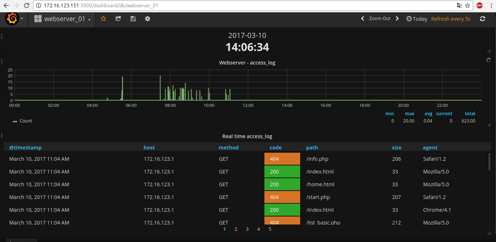

# 
 FEG-stack = Fluentd + Elasticsearch + Grafana 

<pre>
Resumen simple:
<b>Fluentd:</b> Is responsible to data collect and parser.
<b>Elasticsearch:</b> Is responsible to capture the data and save in the database.
<b>Grafana:</b> Is responsible to do graphs and log's tables.

LOGICA:

                                    |                          |
Servers that I want to monitor    - | -> Log collector       - | ----> Grapher or log viewer
                                    |                          |

</pre>

# INFRAESTRUCTURE

<pre>
Webserver01        ---|-->   Fluentd + Elasticsearch  ---|-->  Grafana
Fluentd-Forwarder     |      Fluentd-Agregator           |     Graficador de logs
172.16.123.148        |      172.16.123.147              |     172.16.123.146

#-----------------------------------------------------------------------------------------
# <b>A IMPORTANT detail:  All servers must have the same date and time. </b>
# <b>If the time and date are not the same, grafana it will show difference in the graphs.</b>
#-----------------------------------------------------------------------------------------

</pre>

# TD-AGENT FORWARDER INSTALATION - WEBSERVER BASIC

<pre>
#--------------------
SO:  CentOS 7
Arch: 64bit
RAM: 512M
HDD: 5Gb
IP: 172.16.123.148
ROL: fluentd-Forwarder
#-------------------

I set the same date and hour for all servers. (If you use ansible: ansible all_servers -a "date --set '2017-03-08 08:39' " )
	date --set "2017-03-08 08:39"

Install apache
	yum install -y httpd

Enable apache service
	systemctl enable httpd.service

Start apache service
	systemctl start httpd

I donwnload the td-agent RPM
	wget http://packages.treasuredata.com.s3.amazonaws.com/2/redhat/7/x86_64/td-agent-2.3.3-0.el7.x86_64.rpm

I install the package
	yum localinstall td-agent-2.3.3-0.el7.x86_64.rpm -y

I configure the td-agent.conf
	vim /etc/td-agent/td-agent.conf
		https://github.com/jpradoar/FEG-stack/blob/master/td-agent.conf_webserver

I assign permissions to td-agent do read logs.
	chmod -R go+rX /var/log/httpd

Enable and start the service
	/sbin/chkconfig td-agent on && systemctl start td-agent

I check if the log have some error, If don't have errors is Ok :)
	tailf /var/log/td-agent/td-agent.log

</pre>
# ELASTICSEARCH + TD-AGENT AGGREGATOR:  INSTALLATION PROCESS (fluentd + elasticsearch)
<pre>

#--------------------
SO:  CentOS 7
Arch: 64bit
RAM: 1Gb
HDD: 5Gb
IP: 172.16.123.147
ROL: fluentd-Aggregator
#-------------------

#------------------ ELASTICSEARCH -------------------# 

if did not use ansible or saltstack, check if the date and hour is correct
	date --set "2017-03-08 xx:xx"  # ( the date and hours must be equal to the server!!)

Add repo
	vim /etc/yum.repos.d/elasticsearch.repo
[elasticsearch-5.x]
name=Elasticsearch repository for 5.x packages
baseurl=https://artifacts.elastic.co/packages/5.x/yum
gpgcheck=1
gpgkey=https://artifacts.elastic.co/GPG-KEY-elasticsearch
enabled=1
autorefresh=1
type=rpm-md

Install dependencies:
	yum install java-1.8.0-openjdk -y

Install elasticsearch
	yum install elasticsearch -y

In my case, I change of elasticsearch memory size. (I set it in 256Mb. Sorry I have a poor server :(   
	sed -i 's/-Xms2g/-Xms256M/g' /etc/elasticsearch/jvm.options
	sed -i 's/-Xmx2g/-Xmx256M/g' /etc/elasticsearch/jvm.options

Edit the elasticsearch.yml (uncoment: path.data, network.host, http.port)
	sed -i 's/#path.data: \/path\/to\/data/path.data: \/var\/lib\/elasticsearch /g' /etc/elasticsearch/elasticsearch.yml
	sed -i 's/#network.host: 192.168.0.1/network.host: 172.16.123.147/g' /etc/elasticsearch/elasticsearch.yml
	sed -i 's/#http.port: 9200/http.port: 9200/g' /etc/elasticsearch/elasticsearch.yml

#------------------------ FLUENTD ---------------------#
I need ruby > 2.1.0  for the fluentd plugin to run in elasticsearch.
---------------------------------------------------------

Install Ruby 2.1.8 (the process to compile is too long, You are need some patience... )
	curl -sSL https://rvm.io/mpapis.asc | gpg2 --import -
	curl -L get.rvm.io | bash -s stable
	source /etc/profile.d/rvm.sh
	rvm install 2.1.8

check if the correct version.
	ruby -v
	ruby 2.1.8p440 (2015-12-16 revision 53160) [x86_64-linux]

Download the td-agent RPM (32/64 bits)
	wget http://packages.treasuredata.com.s3.amazonaws.com/2/redhat/7/x86_64/td-agent-2.3.3-0.el7.x86_64.rpm
	wget http://packages.treasuredata.com.s3.amazonaws.com/2/redhat/6/i386/td-agent-2.3.0-0.el6.i386.rpm

Install the package
	yum localinstall td-agent-2.3.3-0.el7.x86_64.rpm -y

Install the fluentd pligin to elasticsearch (take a  time...)
	/usr/sbin/td-agent-gem install fluent-plugin-elasticsearch

Configure the Aggregator:
	https://github.com/jpradoar/FEG-stack/blob/master/td-agent.conf_aggregator

Enable and start the td service.
	/sbin/chkconfig td-agent on && systemctl start td-agent

Enable and start the elasticsearch service.
	systemctl enable elasticsearch.service && systemctl start elasticsearch

I check, if server listen on the correct port. 
	netstat -lptn | grep 9200
	tcp6       0      0 172.16.123.149:9200     :::*    LISTEN    24584/java 

Ok, now you need to access to webserver to generate a login (in access_log )
	http://172.16.123.150/ 

Check the grafana Indexes.  Here, the important is the index, in this case we are interested the apache-2017.03.08
	curl -XGET 'http://172.16.123.147:9200/_cat/indices?v'
	yellow open   apache-2017.03.08 cQX9DQJ_RfyKR4I0kkxtFA   5   1      3       0     22.2kb         22.2kb

To delete a created index:
       curl -XDELETE 'http://172.16.123.147:9200/apache-2017.03.08'

</pre>

# GRAFANA INSTALLATION PROCESS
<pre>

#--------------------
SO:  CentOS 7
Arch: 64bit
RAM: 1Gb
HDD: 5Gb
IP: 172.16.123.146
ROL: Grafana
#-------------------

Set the dateee... (I'm sorry, I remember it so you do not forget it) 

vim /etc/yum.repos.d/grafana.repo

[grafana]
name=grafana
baseurl=https://packagecloud.io/grafana/stable/el/6/$basearch
repo_gpgcheck=1
enabled=1
gpgcheck=1
gpgkey=https://packagecloud.io/gpg.key https://grafanarel.s3.amazonaws.com/RPM-GPG-KEY-grafana
sslverify=1
sslcacert=/etc/pki/tls/certs/ca-bundle.crt

Install grafana
	yum install grafana -y
	
	
I Installed some cool plugins to show beautiful things :)
	grafana-cli plugins install jdbranham-diagram-panel
	grafana-cli plugins install grafana-piechart-panel
	grafana-cli plugins install grafana-clock-panel

#------------ CONFIGURACION DE GRAFANA --------------------#

# I uncomment the following
data, logs, plugins, protocol, httpd_addr + Server_IP, http_port, domain + Server_IP

sed -i 's/;data = /data = /g' /etc/grafana/grafana.ini
sed -i 's/;logs = /logs = /g' /etc/grafana/grafana.ini
sed -i 's/;plugins = /plugins = /g' /etc/grafana/grafana.ini
sed -i 's/;protocol = /protocol = /g' /etc/grafana/grafana.ini
sed -i 's/;http_addr = /http_addr = 172.16.123.146/g' /etc/grafana/grafana.ini
sed -i 's/;http_port = /http_port = /g' /etc/grafana/grafana.ini
sed -i 's/;domain = localhost/;domain = 172.16.123.146/g' /etc/grafana/grafana.ini

Enable the service
	systemctl enable grafana-server.service

configure service to start 
	/sbin/chkconfig --add grafana-server

start the service
	systemctl start grafana-server

check the status, 
	systemctl status grafana-server

access to grafana from web browser (admin:admin)
	http://172.16.123.146:3000/

</pre>

# SCRIPT REQUEST GENERATOR

<pre>
#!/usr/bin/python
# simple script to generate false request, this is good to test on real time if all is Ok   :)

import os
import random
import time

RequestIP="172.16.123.150"

request_num=random.randint(1,30) 
def tiempo():
	for i in xrange(20):
    		n = random.random()
    		print "Milisegundos: " + str(n)
    		time.sleep(n)
		return

	url_index = ['index.html', 'home.html', 'message.html', 'welcome.html', 'list.php', 'start.php', 'info.php', 'home.php', 'users.php', 'list_basic.php', ' ',]
	agente = ['Mozilla/5.0', 'Chrome/4.1', 'Opera', 'Safari/1.2']
	comando="curl -A "+(random.choice(agente))+" -XGET http://"+RequestIP+"/"+(random.choice(url_index))+" >/dev/null"
	os.system(comando)
	print comando
	tiempo()
# EOF
</pre>

# 
REAL CASES  :)  

# 
GRAFICO Y REQUEST

  

# 
DASHBOARD SQUID-PROXY

  

<pre>

##############################################################################
Fuentes:
http://docs.fluentd.org/v0.12/articles/in_tail
http://www.fluentd.org/
https://www.elastic.co/downloads/elasticsearch
https://github.com/uken/fluent-plugin-elasticsearch
https://tecadmin.net/install-ruby-2-1-on-centos-rhel/
http://www.rubydoc.info/gems/fluent-plugin-elasticsearch/1.0.0
http://guides.rubygems.org/command-reference/
</pre>

